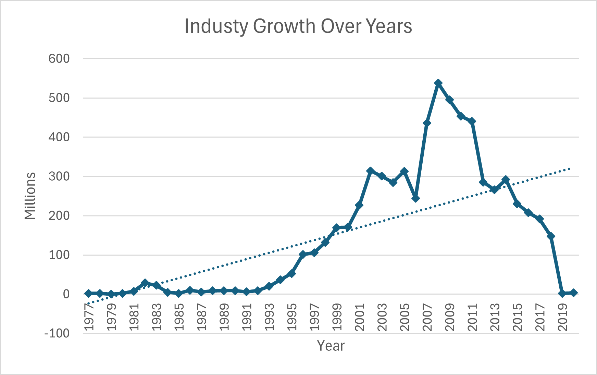
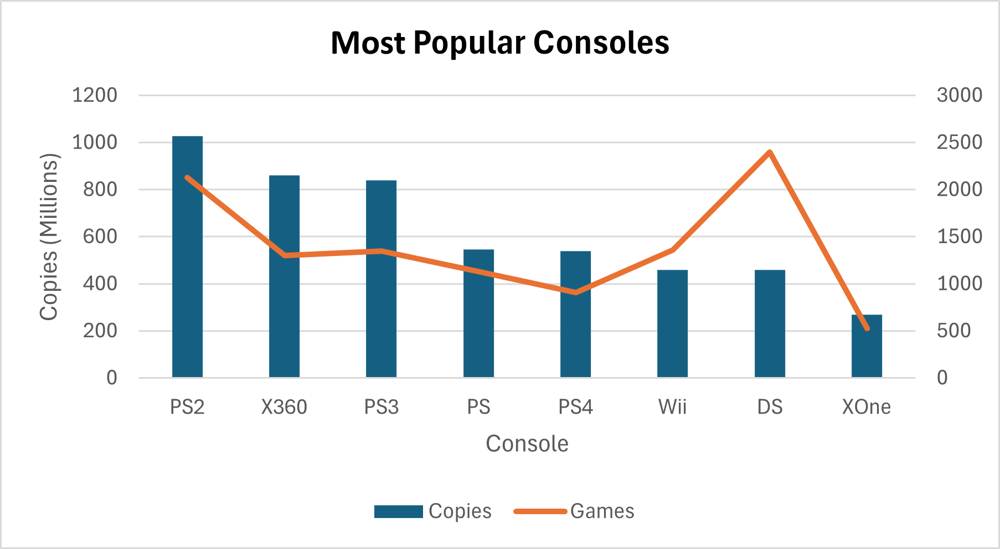
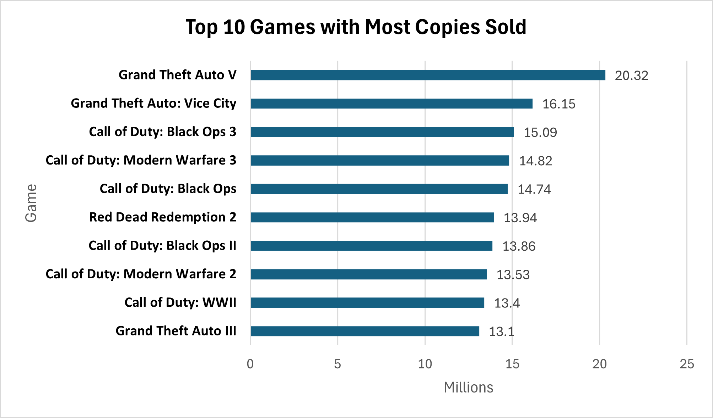

# 🎮 Video Game Sales Analysis SQL Project

Analyze a dataset of 64,000 video games across various consoles, genres, and regions using SQL. This project explores trends in sales, regional preferences, popular genres, and more.

---

## 📊 Dataset Overview

- Contains **64,000+ games**
- Columns include `title`, `console`, `genre`, `release_date`, `total_sales`, `na_sales`, `jp_sales`, `critic_score`, etc.

## 🏆 Top-Selling Games

### 1. Best-Selling Game (Worldwide)

```sql
SELECT
  title, console, genre, total_sales AS copies_sold, release_date
FROM games
WHERE total_sales = (SELECT MAX(total_sales) FROM games);
```

### 2. Top 10 Best-Selling Titles

```sql
SELECT
  title, MAX(total_sales) AS copies_sold
FROM games
WHERE total_sales IS NOT NULL
GROUP BY title
ORDER BY copies_sold DESC
LIMIT 10;
```

### 3. Highest-Selling Game per Console

```sql
SELECT
  title, console, genre, copies_sold
FROM (
  SELECT
    title, console, genre, total_sales AS copies_sold,
    RANK() OVER(PARTITION BY console ORDER BY total_sales DESC) AS rnk
  FROM games
  WHERE total_sales IS NOT NULL
) ranked
WHERE rnk = 1;
```

---

## ⏳ Yearly Sales Analysis

### 1. Peak Year for Global Sales

```sql
SELECT
  EXTRACT(YEAR FROM release_date) AS year,
  SUM(total_sales) AS copies_sold
FROM games
WHERE total_sales IS NOT NULL AND release_date IS NOT NULL
GROUP BY year
ORDER BY copies_sold DESC
LIMIT 1;
```

### 2. Year-over-Year Industry Growth

```sql
WITH yearly_sales AS (
  SELECT
    EXTRACT(YEAR FROM release_date) AS year,
    SUM(total_sales) AS copies_sold
  FROM games
  WHERE total_sales IS NOT NULL AND release_date IS NOT NULL
  GROUP BY year
)
SELECT
  year,
  copies_sold,
  LAG(copies_sold) OVER (ORDER BY year) AS last_year_copies,
  ROUND((copies_sold - LAG(copies_sold) OVER (ORDER BY year)) /
        LAG(copies_sold) OVER (ORDER BY year) * 100, 2) AS growth_percent
FROM yearly_sales;
```

---

## 🎮 Console & Genre Insights

### 1. Dominant Genre per Console (50%+ share)

```sql
WITH game_count AS (
  SELECT console, genre, COUNT(*) AS games_count
  FROM games
  GROUP BY console, genre
),
genre_rank AS (
  SELECT *,
    RANK() OVER (PARTITION BY console ORDER BY games_count DESC) AS rnk
  FROM game_count
),
console_total AS (
  SELECT console, COUNT(*) AS total_games
  FROM games
  GROUP BY console
)
SELECT
  g.console,
  g.genre,
  g.games_count,
  ROUND(g.games_count * 100.0 / c.total_games, 2) AS genre_percentage
FROM genre_rank g
JOIN console_total c ON g.console = c.console
WHERE g.rnk = 1 AND ROUND(g.games_count * 100.0 / c.total_games, 2) > 50;
```

---

## 🌍 Regional Popularity vs. Flops

### Titles That Are Popular in One Region but Flop in Another

```sql
WITH regions AS (
  SELECT
    title, console, total_sales,
    COALESCE(ROUND(na_sales * 1.0 / total_sales, 2), 0) AS na,
    COALESCE(ROUND(jp_sales * 1.0 / total_sales, 2), 0) AS jp,
    COALESCE(ROUND(pal_sales * 1.0 / total_sales, 2), 0) AS eu,
    COALESCE(ROUND(other_sales * 1.0 / total_sales, 2), 0) AS other
  FROM games
  WHERE total_sales IS NOT NULL AND total_sales <> 0
)
SELECT *,
  CASE
    WHEN na > jp AND na > eu AND na > other THEN 'North America'
    WHEN jp > na AND jp > eu AND jp > other THEN 'Japan'
    WHEN eu > na AND eu > jp AND eu > other THEN 'Europe/Africa'
    ELSE 'Other Regions'
  END AS popular_region,
  CASE
    WHEN na < jp AND na < eu AND na < other THEN 'North America'
    WHEN jp < na AND jp < eu AND jp < other THEN 'Japan'
    WHEN eu < na AND eu < jp AND eu < other THEN 'Europe/Africa'
    ELSE 'Other Regions'
  END AS flop_region
FROM regions
ORDER BY total_sales DESC;
```

---

## 🧠 Critic Score Insights

### 1. Top-Rated Titles by Critics

```sql
SELECT
  title,
  ROUND(AVG(critic_score), 2) AS avg_critic_score
FROM games
WHERE critic_score IS NOT NULL
GROUP BY title
ORDER BY avg_critic_score DESC
LIMIT 10;
```

---

## 🕹️ Most Popular Consoles by Sales

```sql
SELECT
  console,
  SUM(total_sales) AS copies_sold,
  COUNT(*) AS games_count
FROM games
WHERE total_sales IS NOT NULL
GROUP BY console
ORDER BY copies_sold DESC, games_count DESC
LIMIT 5;
```

---

## 💡 Business Insights

- Certain games perform extremely well in Japan but flop in North America, and vice versa — localization and market fit are critical.



- The video game industry has grown over the years especially after the year `1993`.



- `PlayStation` is dominating the video games industry with the highest copies sold with it's four version.

- Game development companies must take this into consideration when determining which consoles their new game will be compatible with.



- New releases of a successful can maintain audience engagement and generate consistent revenue streams for game development companies

- The list is dominated by `action/shooter` genres, indicating these categories have the broadest mainstream appeal for achieving maximum sales figures.

## 🧰 Tools Used

- PostgreSQL (compatible with most SQL flavors)
- DBeaver for running queries and exploring data

- Excel for Data Visualization
